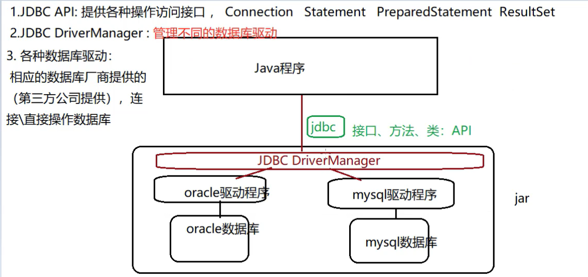
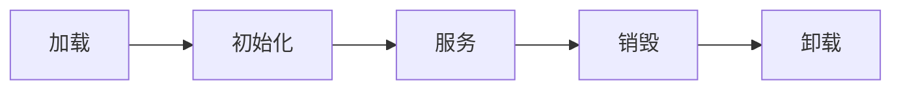
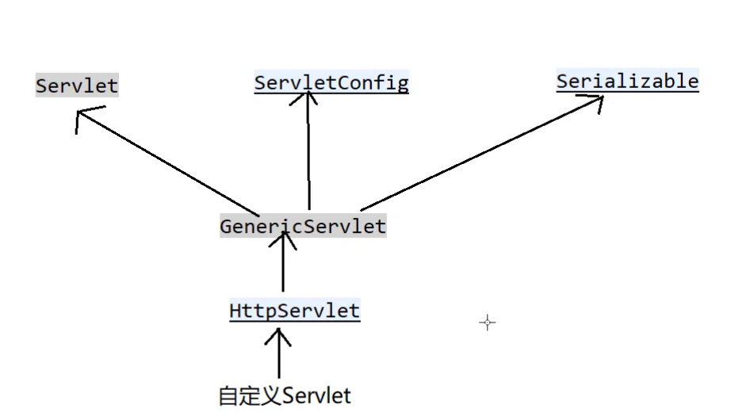
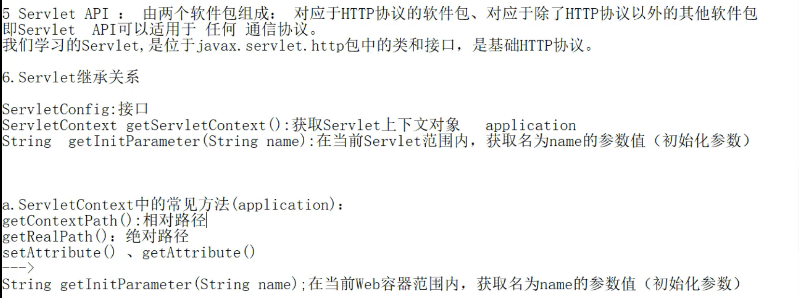

[TOC]

# javaweb笔记

## 访问tomcat

http://localhost:8080/

## 常见状态码

- 200：一切正常
- 300/301：页面重定向（跳转）
- 404：资源不存在
- 403：权限不足（如果访问a目录，但是a目录设置不可见）
- 500：服务器内部错误（代码有误）
- 其他...

## jsp:在html中嵌套的代码

- 在项目/WEB-INF/web.xml中设置默认的初始页面

```xml
<welcome-file-list>
		<welcome-file>index2.jsp</welcome-file>
</welcome-file-list>
```

## 虚拟路径

### a.第一种方式（需要把tomcat重启）

将web项目配置到webapps以外的目录

conf/server.xml中配置

host标签中

```xml
<Context docBase="" path="/JspProject"  />
```

- docBase：实际路径

- path：虚拟路径（绝对路径、相对路径【相对于webapps】）

### b.第二种方式

在conf\localhost文件夹中新建一个文件，名称为项目名.xml，新增一行即可

```xml
<Context docBase="" path="/JspProject"  />
```

## 虚拟主机

通过www.jd.com访问本机

- conf/server.xml

  ```xml
  <Engine name="Catalina" defaultHost="www.test.com">
      <Host appBase="D:\study\JspProject" name="www.test.com">
          <Context docBase="D:\study\JspProject" path="\"> </Context>
      </Host>
  </Engine>
  ```

- C:\Windows\System32\drivers\etc\host 增加  IP地址  链接

## Jsp的执行流程


第一次访问：服务器将jsp翻译成java(servlet)，再将java编译成class文件

第二次访问：直接访问class文件（如果服务端代码修改，将会在访问时重新翻译和编译）

Jsp和Servlet可以相互转换

## 使用Eclipse开发jsp项目

### 关联服务器

- 在Windows下的perference里面搜索Runtime Environment，可以看到关联的服务器版本设置一下即可（设置Apache版本和jre）
- 在面板里面配置（没有项目直接点finish）

### 创建项目

- 创建项目（Dynamic web project），不管servelight版本，配置tomcat版本，点击next，然后选中创建xml文件（必须选中）
- 在WebContent里面的文件是可以直接访问到的，在WenContent里面的WEB-INF目录下的文件是不能通过客户端直接访问到的，原因是权限比较高，只能通过请求转发访问

**注意：并不是任何的内部跳转都能访问到WEB-INF；原因是 跳转有两种方式：请求转发、重定向**

### 有的版本创建后第一行会报错，解决方案为配置tomcat运行环境

- 第一种方法：将tomcat/lib中的servlet-api.jar加入项目中的构建路径
- 第二种方法：右键项目->Build Path->Add Library->Servert Runtime

### 统一字符集编码

- a.编码分类：
  - 设置jsp文件编码（jsp文件中的pageEncoding属性）：jsp->java
  - 设置浏览器读取jsp文件的编码（jsp文件中的Content属性）
  - 一般将上述设置成一样的一致的编码 utf-8
  - 文本编码：将整个eclipse中的文件统一设置
    - 全局设置：在preference中搜索jsp找到Jsp Files，里面的Encoding改成utf-8
    - 设置某一个项目：

### JSP页面元素：

- a.脚本Scriptlet

  - i.

    ```jsp
    <%
    	//这里放置java代码，定义局部变量，java语句
    	//如下所示：
    	String name = "zhangsan";
    	out.print("hello..."+name);
    %>
    ```

  - ii.

    ```jsp
    <%!
    	//定义全局变量，定义方法，如下所示：
    	public String bookName;
    	public void init(){
        	bookName = "java书";
    	}
    %>
    ```

  - iii.

    ```jsp
    <%=输出表达式%> // 等同于out.print();
    ```

  一般而言，修改web.xml、配置文件、java 需要重启tomcat服务

  但是如果修改Jsp/html/css/js，不需要重启
  
  用out.print和out.println都不会回车，因为最终会转化为html代码，因此要想回车必须写html代码
  
  ```html
  <br/>
  ```
  
  - b.page指令
  
    ~~~html
    <%@ page ....%>
    ~~~
  
    - page:指定的属性
    - laungage:jsp页面使用的脚本语言
    - import:导入类
    - pageEncoding:jsp自身编码，jsp转java
    - contentType:浏览器解析页面编码
  
  - c.注释
  
    - html注释(可以被客户通过浏览器查看源码看见)
  
      ~~~html
      <!-- -->
      ~~~
  
    - java注释
  
      ~~~java
      //
      ~~~
  
    - jsp注释
  
      ~~~jsp
      <%-- --%>
      ~~~
  
  ### jsp内置对象（自带的， 不需要new也能使用的）
  
  - out：输出对象，向客户端输出内容
  
  - request：请求对象，存储**客户端向服务器端发送的请求信息**
  
    request对象的常见方法：
  
    - String[] getParameter(String name):根据请求的字段名key，返回多个字段值value
    - String getParameterValues(String name):根据请求的字段名key，返回字段值value
    - void setCharacterEncoding("编码格式utf-8"):设置请求编码，tomcat8及以后改为utf-8
    - getRequestDispatcher().forward(request, response);：请求转发的跳转页面  A -> B
    - getServerContext():获取项目的ServletContext对象
  
    提交的数据如下（地址栏提交方式）：
  
    ```link
    http://localhost:8080/MyJspTest/show.jsp?uname=123456&upwd=123456&uage=25&uhobbies=%E5%94%B1&uhobbies=%E8%B7%B3&uhobbies=rap&uhobbies=%E7%AF%AE%E7%90%83
    ```
  
    从uname开始之后的都是提交的数据
  
    get提交方式 :
  
    
  
    和地址栏提交方式以及超链接方式都属于get方式
  
    get与post请求方式的区别：
  
    - a.get方式在地址栏上显示请求信息（信息有限4-5kb，如果存在大文件就会出错）； post不会
    - b.文件上传操作：必须是post
  
    **统一编码：在server.xml中统一get方式的编码：**
  
    ```xml
    URIEncoding = "UTF-8"
    ```
  
    
  
  - response：响应对象
  
    提供方法：
  
    - void addCookie(Cookie cookie) : 服务端向客户端增加cookie对象
  
    - void sendRedirect(String location) throws IOException: 重定向，页面跳转的一种方式
  
      重定向会导致数据丢失，使用**request.getRequestDispatcher().forward(request, response);**进行页面跳转，请求转发，可以获取到数据，但是地址栏没有改变。
  
      **请求转发与重定向的区别**：
  
      - 1.地址栏是否改变 请求转发不会改变，重定向会改变
      - 2.是否保留第一次请求时的数据 请求转发会保留，重定向不会保留
      - 3.请求的次数 请求转发是1次，重定向是2次（重定向相当于告诉你**你找错人了**，然后你要重新找，因此发送了两次请求，第二次窗口也会变）
      - 
      - 
  
      
  
    - void setContentType(String type):设置服务端响应编码（设置服务端的contentType类型）
  
  - session：会话
  
    - session与Cookie:
  
      - session是内置对象（服务端），Cookie不是内置对象（客户端）：Cookie是由服务端产生，再发送给客户端保存。Cookie就是本地缓存，相当于本地缓存的作用：客户端->服务端(Hello.mp4)
  
      - Cookie提高访问的效率但是安全性差。
  
      - Cookie：key=value
  
        javax.servlet.http.Cookie
  
        public Cookie(String key, String value)：构造方法
  
        String getName()：得到当前Cookie对象的key
  
        String getValue()：得到当前Cookie对象的value
  
        void setMaxAge(int expiry):设置最大有效期（秒）
  
      - 服务端发送给客户端：使用response对象中的addCookie方法：**response.addCookie(Cookie cookie)**
  
        然后使用页面跳转（转发重定向都可以）
  
        客户端获取**cookie:request.getCookies();**(目前来说只能获取全部Cookie)
      
    - sesson机制
  
      客户端第一次请求服务端时（直接匹配失败，因为没有sessionID），服务端会产生一个session对象（用于保存客户端信息）；
  
      并且每个session对象都会有一个唯一的sessionID（用于区分其他sessionID）；
  
      服务端又会产生一个cookie，并且该cookie的name=JSESSIONED，value=服务端sessionID的值；
  
      然后服务端会在响应客户端的同时，将该cookie发送给客户端，至此客户端就有了一个cookie(JSESSIONID)；
  
      因此客户端的cookie就可以和服务端的session一一对应（JSESSIONID - sessionID）。
  
      客户端第二次/第n次请求服务端时：服务端会先用客户端cookie中的JSESSIONID去服务端的session中匹配sessionID，如果匹配成功，说明此用户不是第一次访问，无需登录。
  
    - session共享问题
  
      a.存储在服务端
  
      b.在同一个用户请求时共享，同一浏览器的session是共享的
  
      c.session实现机制：第一次请求时产生一个sessionID，并赋值给cookie的jsessionID然后发送给客户端。最终通过session的jsessionID进行匹配实现一个一一对相应的关系。
  
    - session方法：
  
      **String getID()**:获取sessionID
  
      **boolean isNew()**:判断是否是新用户（第一次访问）
  
      **void invalidate()**:使session失效（退出登录，注销）
  
      **void setAttribute()**:设置
  
      **Object getAttribute()**:
  
      **void setMaxInactiveInterval(秒)**：设置最大有效非活动时间
  
      **int getMaxInactiveInterval()**:获得最大有效非活动时间
  
    - session实现案例
  
      
  
      
  
  - application：全局对象（可以获取到当前项目的一切信息）
  
    - String getContextPath()：获得虚拟路径
    - String getRealPath()：获得绝对路径（虚拟路径相对的绝对路径）
  
  - config
  
  - page
  
  - exception

### 四种范围对象

四种对象的共有方法：

```java
Object getAttribute(String name);//根据属性名或属性值寻找对应的对象
void setAttribute(String name, Object obj);//设置对象，如果之前的name没有映射，那么就将name对应到obj。如果之前的name有映射，那么将name的映射修改为obj
void removeAttribute(String name);//根据属性名删除映射
```

#### pageContext：jsp页面容器

- 范围：当前页面有效

  案例：当跳转到其他页面时，保存的内容会变为空，**页面跳转后无效**

#### request：请求对象

- 范围：同一次请求有效

  案例：请求转发相当于一次请求，重定向时这个值就拿不到了，重定向相当于两次请求

#### session：会话对象

- 范围：同一次会话有效（无论怎么跳转都有效；**重定向后无效**）

#### application：全局对象

- 范围：全局有效（在整个项目运行期间都有效，切换浏览器也有效，**切换项目无效，关闭服务器无效**）

尽量用小的对象，因为对象的范围越大，对性能的损耗越大。

## JDBC的使用

### JDBC的主要功能

- DriverManager：管理JDBC的驱动
- Connection：连接
- Statement(PreparedStatement):增删改查
- CallableStatement：调用数据库中的 存储过程/存储函数
- Result：返回的结果集



- Connection产生Statement对象：createStatement()
- Connection产生PreparedStatement对象：prepareStatement()
- Connection产生CallableStatement对象：prepareCall();

#### ResultSet

- 保存结果集：

```sql
select * from Xxx
```

- next()：光标下移，返回是否有下一条数据 true/false
- previous()：true/false
- getXxx(字段名|位置)

#### Statement操作数据库

- 增删改：executeUpdate()
- 查询：executeQuery()

#### PreparedStatement操作数据库

```java
public interface PreparedStatement extends Statement
```

因此

- 增删改：executeUpdate();
- 查询：executeQuery();
- 赋值操作：setXxx();

可以进行预编译

```java
String sql = "insert into student values(?,?,?,?);";//先进行预编译再进行set
PreparedStatement pstmt = connection.prepareStatement(sql);
pstmt.setInt(1, 36);
pstmt.setString(2, "zhangsan");
pstmt.setInt(3, 36);
pstmt.setInt(4, "s3");

int count = pstmt.executeUpdate();
```

#### Statement与PreparedStatement的区别

**推荐使用PreparedStatement，原因如下：**

1. 编码更加简便（避免了字符串的拼接）

   - stmt:

     ```java
     String sql = "insert into student(stuno, stuname) values('"+name+"', "+age+");";
     stmt.executeUpdate(sql);
     ```

   - pstmt:

     ```java
     String sql = "insert into student(stuno, stuname) values(?,?);";
     pstmt = connection.prepareStatement(sql);//预编译
     pstmt.setString(1, name);
     pstmt.setInt(2, age);
     ```

2. 提高性能（因为有预编译操作，因此只需要编译一次）

   需要重复增加100条时，stmt需要编译100次，pstmt只需要编译一次

3. 安全（可以有效防止被注入）

   stmt:存在被注入的风险

   pstmt:防止sql被注入

#### CallableStatement：调用存储过程、存储函数（未完！！）

```java
connection.prepareCall(参数：存储过程或存储函数名);
```

参数格式：

存储过程（无返回值return，用Out参数替代）：

{ call 存储过程名(参数列表) }

存储函数（有返回值return）：

{? = call 存储函数名（参数列表）}

#### 处理CLOB[Text]/BLOB类型（未完！！）

a. 存储路径 

- 存储：将路径和完整文件名以字符串形式存储到数据库中
- 获取：1.获取该路径 2.使用Java IO获取

b.使用CLOB/BLOB

- CLOB：大文本数据 （小说）
- BLOB：二进制文件

### JDBC访问数据库的主要步骤

- 导入驱动，加载具体的驱动类（具体连接的是的哪种数据库）
- 与数据库建立连接
- 发送sql，执行
- 处理结果集（查询）

### 数据库驱动

|           | 驱动jar                    | 具体驱动类                                   | 连接字符串                                                   |
| --------- | -------------------------- | -------------------------------------------- | ------------------------------------------------------------ |
| Oracle    | ojdbc-x.jar                | oracle.jdbc.OracleDriver                     | jdbc:oracle:thin:@localhost:1521:ORCL                        |
| MySQL     | mysql-connector-java-x.jar | com.mysql.jdbc.Driver                        | jdbc:mysql://localhost:3306/数据库实例名                     |
| SqlServer | sqljdbc-x.jar              | com.microsoft.sqlserver.jdbc.SQLServerDriver | jdbc:microsoft:sqlserver:localhost:1433;databasename=数据库实例名 |

## Servlet生命周期



在加载和卸载时，Servlet容器会自动处理

- 加载
- 初始化：init() , 该方法会在Servlet被加载并实例化的以后执行
- 服务：service() -> doGet()    doPost()
- 销毁：destroy(),   Servlet被系统回收会被执行
- 卸载

若想要在服务器启动时就初始化，在web.xml里面servlet标签内加入语句（servlet2.5）

```xml
<load-on-startup></load-on-startup>
```

然后在这个标签中间插入1即可

其中的数字1代表顺序第一个执行

也可以直接在servlet中初始化，将头部的@WebServlet变为以下语句

```java
@WebServlet(value="", loadOnStartup=1)
```

## Servlet API

### Servlet继承关系





## MVC三层架构

与MVC设计模式的目标一致：都是为了解耦合、提高代码复用；区别：而这对项目的理解角度不同

### 三层组成

1. 表示层（USL， User Show Layer； 视图层）

   - 前台：对应于MVC中的View， 用于和用户交互、界面的显示

     jsp js html css jquery等web前端技术

   - 后台：对用于MVC中的Controller， 用于**控制跳转、调用业务逻辑**层

     Servlet (SpringMVC Struts2), 位于xxx.swervlet包中

2. 业务逻辑层（BLL， Business Logic Layer； Service层）

   - 直接访问数据库，原子性的操作（增删改查）

     一般位于xxx.service包中(也可以称为xxx.manager, xx.bll)

   - 接收表示层的请求调用

3. 数据访问层（DAL， Data Access Layer； Dao层）

   - 直接访问数据库的操作，原子性的操作（增删改查）

     一般位于xxx.dao包

### 三层间的关系

## 下载

1. 请求（地址a， form），请求Servlet

```jsp
<a href="DownloadServlet?filename=index.jsp">下载</a>
```

如上所示，传递文件名

1. Servlet通过文件的地址 将文件转为输入流 读到Servlet中
2. 通过输出流下载

| 文件类型                     | Content-Type                     |
| ---------------------------- | -------------------------------- |
| 二进制文件（任何类型的文件） | application/octet-stream         |
| Word                         | application/msword               |
| Excel                        | application/vmd-ms-excel         |
| 图片                         | image/gif, image/bmp, image/jpeg |
| 文本文件                     | text/plain                       |
| html网页                     | text/html                        |

注意：下载文件需要设置两个响应头，如下所示

```java
response.addHeader("contentType", "application/octet-stream");//对应的表，当前为二进制
response.addHeader("content-Disposition", "attachment;filename="+fileName);
```

